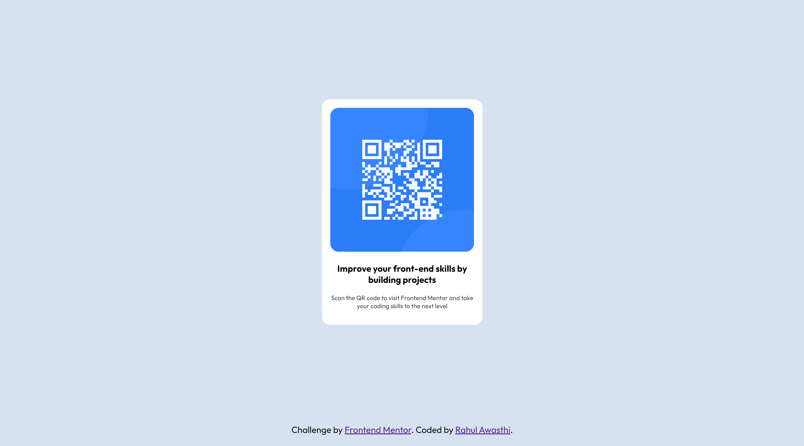
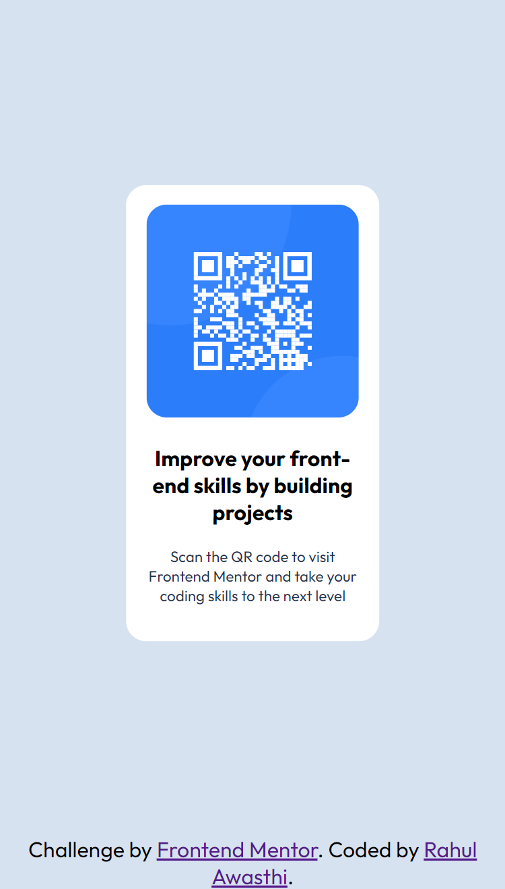

# Frontend Mentor - QR code component solution

This is a solution to the [QR code component challenge on Frontend Mentor](https://www.frontendmentor.io/challenges/qr-code-component-iux_sIO_H). Frontend Mentor challenges help you improve your coding skills by building realistic projects. 

## Table of contents

- [Overview](#overview)
  - [Screenshot](#screenshot)
  - [Links](#links)
- [My process](#my-process)
  - [Built with](#built-with)
  - [What I learned](#what-i-learned)
  - [Useful resources](#useful-resources)
- [Author](#author)


## Overview

### Screenshot




### Links

- Solution URL: [solution](https://github.com/rahulawasthi314/frontend-mentor-exercises/qr-code-component-main/)
- Live Site URL: [Add live site URL here](https://github.com/rahulawasthi314/frontend-mentor-exercises/qr-code-component-main)


### Built with

- Semantic HTML5 markup
- CSS custom properties
- Flexbox
- CSS Grid
- Mobile-first workflow
- [React](https://reactjs.org/) - JS library
- [Next.js](https://nextjs.org/) - React framework
- [Styled Components](https://styled-components.com/) - For styles

**Note: These are just examples. Delete this note and replace the list above with your own choices**

### What I learned

```css
@media screen and (min-width: 300px) {
    .card  :last-child {
        font-size: 0.7em;
    }
    
}
@media screen and (min-width: 600px) {
    .card-wrapper {
        width: 30vw;
    }
}
@media screen and (min-width: 1000px) {
    .card-wrapper {
        width: 20vw;
    }
}
```

### Useful resources

- [Media Queries](https://www.w3schools.com/css/css3_mediaqueries.asp) - This helped me for media queries. I really liked this pattern and will use it going forward.
- [Units in CSS](https://www.w3schools.com/cssref/css_units.asp) - This is an amazing article which helped me finally understand Units. I'd recommend it to anyone still learning this concept.

**Note: Delete this note and replace the list above with resources that helped you during the challenge. These could come in handy for anyone viewing your solution or for yourself when you look back on this project in the future.**

## Author

- Website - [Rahul Awasthi](https://www.github.com/rahulawasthi314)
- Frontend Mentor - [@RahulAwasthi314](https://www.frontendmentor.io/profile/RahulAwasthi314)
- Twitter - [@awasthir314](https://www.twitter.com/awasthir314)
